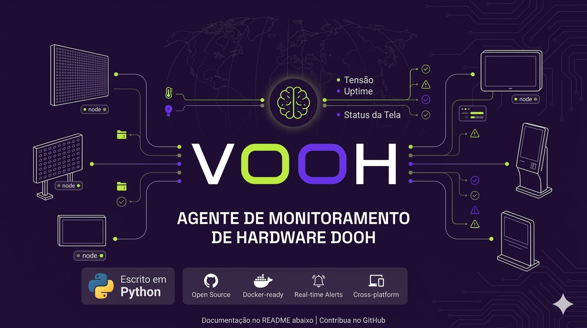

# Agente de Monitoramento VOOH para dispositivos DOOH

Este repositório conta com um projeto acadêmico para captura de dados de dispositivos DOOH, 2º semestre do curso de 
Ciência da Computação da São Paulo Tech School - SPTECH ([@BandTec](https://github.com/BandTec))

# Tecnologias

Este projeto utiliza a biblioteca **psutil** como principal meio de obtenção de dados de dispositivos, capturando
informações de uso dos recursos como:

- CPU
- Memória RAM
- Disco
- Rede
- Processos
    - Uso de memória
    - Uso de CPU
    - PID

Outra biblioteca usada para exibição mais confortável dos dados, é o **colorama**.

Também foi utilizada uma biblioteca da **_Amazon Web Service (AWS)_**, **boto3**, que faz envio de dados para um bucket no serviço **_Simple Storage Service (S3)_** da **_AWS_**.

## Instalação

Para realizar a instalação do agente, é necessário possuir o **git**, **python3** e seu gerenciador de pacotes **pip**.

Para clonar este repositório, use o seguinte comando no terminal:

```
git clone https://github.com/V-OOH/agent-v-ooh
```

Para instalar as dependências usadas neste projeto, use o seguinte comando em seu terminal, na **raiz do projeto**:

```
pip install -r requeriments.txt
```

### Dispositivos com Linux

Para instalar as dependências em dispositivos com Linux, é recomendável utilizar um ambiente virtual python (venv),
para evitar quebrar o seu sistema.

Utilize o seguinte comando para criar um ambiente virtual:

```
cd agent-vooh/
python3 -m venv .venv
```

Para ativar o ambiente virtual, basta executar:

```
source .venv/bin/activate
```

**Observações:**

Caso esteja usando um **shell** que não seja o **bash**, como, por exemplo, o **fish**, use o comando abaixo ou o respectivo de seu shell:

```
source .venv/bin/activate.fish
```

É necessário configurar um `.env` com seus dados de credenciais da **_AWS_**, sendo:

- `AWS_ACCESS_KEY_ID` - Token de ID de sessão
- `AWS_SECRET_ACCESS_KEY` - Token secreto de chave de acesso
- `AWS_SESSION_TOKEN` - Token de sessão
- `AWS_BUCKET_NAME` - Nome do bucket S3
- `AWS_OBJECT_NAME` - Nome do objeto a ser enviado/salvo no bucket s3

## Execução

Com todas as dependências instaladas e/ou ambiente virtual configurado no dispositivo que irá ser monitorado,
você executar o agente com o seguinte comando:

```
python3 main.py [frequência]
```


`frequência` é o tempo em segundos entre capturas

As informações coletadas ficam em `data/`, onde há arquivos .CSV de dados do sistema e processos.
